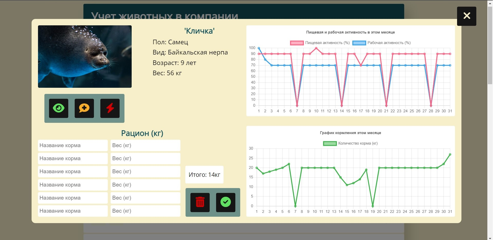
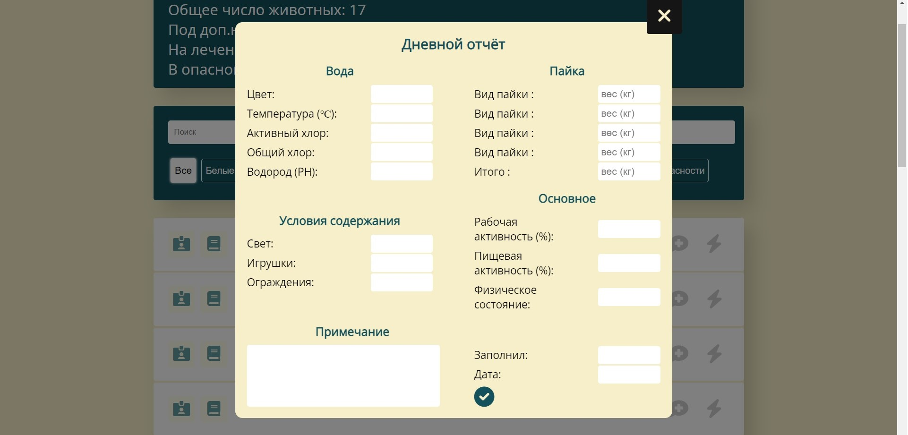

# Animal Report

🐾 An application created using the React library, the main purpose of which is to create an animal control accounting system.



💉 The accounting system was created for veterinary control and control of the diet of animals.



## Features/highlights

-   the application is written using both class and functional React components
-   added search for animals by the occurrence of a word in the animals name
-   implemented additional filtering of animals

## Setup

```bash
$ git clone https://github.com/YuriDubinin/accounting.git
$ cd accounting
$ npm i
$ npm start
```

## Build

```bash
$ npm build
```
